# Certificate Tracker - EKS Deployment (3-tier)

Production-ready deployment of Certificate Tracker application on AWS EKS (Elastic Kubernetes Service).

## Architecture

```mermaid
flowchart TB
    subgraph Docker["Docker Images"]
        React[ReactJS<br/>Frontend]
        Node[NodeJS<br/>Backend]
        DB[MySQL/PostgreSQL<br/>Database]
    end
    
    subgraph ECR["Amazon ECR"]
        ECRRepo[Container Registry<br/>346273507930.dkr.ecr.ap-southeast-1]
    end
    
    React --> ECRRepo
    Node --> ECRRepo
    DB --> ECRRepo
    
    subgraph EKS["EKS Cluster - certificate-tracker"]
        subgraph Storage["Storage Layer"]
            Secrets[Secrets<br/>Credentials & Config]
            PVC[PVC<br/>Persistent Volume]
            SVC[SVC<br/>Services]
        end
        
        subgraph Apps["Application Layer"]
            FE1[Frontend Pod]
            FE2[Frontend Pod]
            BE1[Backend Pod]
            BE2[Backend Pod]
            PG[Database Pod]
            PGA[pgAdmin Pod]
        end
        
        LB[Load Balancer<br/>AWS ELB]
    end
    
    ECRRepo --> FE1
    ECRRepo --> FE2
    ECRRepo --> BE1
    ECRRepo --> BE2
    ECRRepo --> PG
    ECRRepo --> PGA
    
    Secrets -.-> BE1
    Secrets -.-> BE2
    Secrets -.-> PG
    Secrets -.-> PGA
    
    PVC --> PG
    
    FE1 --> BE1
    FE2 --> BE2
    BE1 --> PG
    BE2 --> PG
    
    LB --> FE1
    LB --> FE2
    
    Internet([Internet Users]) --> LB
    
    style EKS fill:#ff6600,stroke:#ff6600,stroke-width:3px
    style Storage fill:#4169E1,stroke:#4169E1,stroke-width:2px
    style Apps fill:#1e3a5f,stroke:#4169E1,stroke-width:2px
    style ECR fill:#ff9900,stroke:#ff9900,stroke-width:2px
```



**Component Details:**
- **Frontend**: 2 replicas (ReactJS on port 3000)
- **Backend**: 2 replicas (NodeJS on port 5000)
- **Database**: 1 replica (PostgreSQL on port 5432)
- **Storage**: 10Gi persistent volume (EBS gp2)
- **Load Balancers**: AWS ELB for public access

**Infrastructure:**
- **Cloud Provider**: AWS (Singapore - ap-southeast-1)
- **Kubernetes**: Amazon EKS 1.30
- **Container Registry**: Amazon ECR
- **Storage**: EBS Volumes (gp2)
- **Load Balancers**: AWS ELB

## Prerequisites

Before deploying, ensure you have:

1. **AWS CLI** configured with credentials
   ```bash
   aws configure
   ```

2. **Terraform** (>= 1.9)
   ```bash
   terraform --version
   ```

3. **kubectl** installed
   ```bash
   kubectl version --client
   ```

4. **Docker images** pushed to ECR:
   - `346273507930.dkr.ecr.ap-southeast-1.amazonaws.com/certificate-tracker/frontend:latest`
   - `346273507930.dkr.ecr.ap-southeast-1.amazonaws.com/certificate-tracker/backend:latest`
   - `346273507930.dkr.ecr.ap-southeast-1.amazonaws.com/certificate-tracker/postgres:latest`
   - `346273507930.dkr.ecr.ap-southeast-1.amazonaws.com/certificate-tracker/pgadmin:latest`

## Project Structure

```
.
├── terraform/           # Infrastructure as Code
│   ├── provider.tf      # AWS provider configuration
│   ├── variables.tf     # Customizable settings
│   ├── vpc.tf          # Network (VPC, subnets, NAT gateway)
│   ├── eks.tf          # EKS cluster & node groups
│   └── outputs.tf      # Important outputs after deployment
│
└── k8s/                # Kubernetes manifests
    ├── namespace.yaml           # certificate-tracker namespace
    ├── secret.yaml             # Database & app credentials
    ├── postgres-pvc.yaml       # Database storage (10Gi)
    ├── postgres-deployment.yaml # PostgreSQL database
    ├── postgres-service.yaml    # Database service
    ├── backend-deployment.yaml  # NodeJS backend (2 replicas)
    ├── backend-service.yaml     # Backend service
    ├── frontend-deployment.yaml # ReactJS frontend (2 replicas)
    ├── frontend-service.yaml    # Frontend LoadBalancer
    ├── pgadmin-deployment.yaml  # pgAdmin admin tool
    └── pgadmin-service.yaml     # pgAdmin LoadBalancer
```

## Deployment Steps

### 1. Create EKS Cluster

```bash
# Navigate to terraform directory
cd terraform/

# Initialize Terraform
terraform init

# Preview changes
terraform plan

# Create cluster (~15 minutes)
terraform apply -auto-approve
```

### 2. Configure kubectl

```bash
# Connect kubectl to your EKS cluster
aws eks update-kubeconfig --region ap-southeast-1 --name certificate-tracker-cluster

# Verify connection
kubectl get nodes
```

### 3. Deploy Application

```bash
# Navigate back to project root
cd ..

# Deploy in order
kubectl apply -f k8s/namespace.yaml
kubectl apply -f k8s/secret.yaml
kubectl apply -f k8s/postgres-pvc.yaml
kubectl apply -f k8s/postgres-deployment.yaml
kubectl apply -f k8s/postgres-service.yaml
kubectl apply -f k8s/backend-deployment.yaml
kubectl apply -f k8s/backend-service.yaml
kubectl apply -f k8s/frontend-deployment.yaml
kubectl apply -f k8s/frontend-service.yaml
kubectl apply -f k8s/pgadmin-deployment.yaml
kubectl apply -f k8s/pgadmin-service.yaml

# Or deploy all at once
kubectl apply -f k8s/
```

### 4. Initialize Database

```bash
# Copy SQL initialization file to postgres pod
kubectl cp init-combined.sql certificate-tracker/$(kubectl get pod -n certificate-tracker -l app=postgres -o jsonpath='{.items[0].metadata.name}'):/tmp/init-combined.sql

# Execute SQL file
kubectl exec -i deployment/postgres -n certificate-tracker -- psql -U postgres -d Kgcarv2 < init-combined.sql

# Restart backend to clear cache
kubectl rollout restart deployment/backend -n certificate-tracker
```

### 5. Get Application URLs

```bash
# Get all service URLs
kubectl get svc -n certificate-tracker

# Frontend URL
kubectl get svc frontend-service -n certificate-tracker -o jsonpath='{.status.loadBalancer.ingress[0].hostname}'

# Backend API URL
kubectl get svc backend-service -n certificate-tracker -o jsonpath='{.status.loadBalancer.ingress[0].hostname}'

# pgAdmin URL
kubectl get svc pgadmin-service -n certificate-tracker -o jsonpath='{.status.loadBalancer.ingress[0].hostname}'
```

## Configuration

### Environment Variables

All sensitive data is stored in `k8s/secret.yaml`:

- **Database**: `Kgcarv2` on port `5432`
- **DB User**: `postgres`
- **SMTP**: Configured for email notifications
- **Ports**: Backend `5000`, Frontend `3000`

### Cluster Settings (terraform/variables.tf)

- **Cluster Name**: `certificate-tracker-cluster`
- **Kubernetes Version**: `1.30`
- **Node Type**: `t3.medium` (2 vCPU, 4GB RAM)
- **Node Count**: 2 (min: 1, max: 4)
- **VPC CIDR**: `10.0.0.0/16`

## Management Commands

### Check Application Status

```bash
# View all resources
kubectl get all -n certificate-tracker

# Check pod status
kubectl get pods -n certificate-tracker

# Check pod logs
kubectl logs -f deployment/backend -n certificate-tracker
kubectl logs -f deployment/frontend -n certificate-tracker
kubectl logs -f deployment/postgres -n certificate-tracker
```

### Update Deployments

```bash
# After pushing new Docker image to ECR
kubectl rollout restart deployment/backend -n certificate-tracker
kubectl rollout restart deployment/frontend -n certificate-tracker

# Check rollout status
kubectl rollout status deployment/backend -n certificate-tracker
```

### Access Database

**Via pgAdmin:**
- URL: Get from LoadBalancer
- Email: `admin@admin.com`
- Password: `admin`

**Via kubectl:**
```bash
# Connect to database directly
kubectl exec -it deployment/postgres -n certificate-tracker -- psql -U postgres -d Kgcarv2

# Run SQL query
kubectl exec -it deployment/postgres -n certificate-tracker -- psql -U postgres -d Kgcarv2 -c "SELECT * FROM users;"
```

## Troubleshooting

### Backend can't connect to database
```bash
# Check database is running
kubectl get pods -l app=postgres -n certificate-tracker

# Check backend logs
kubectl logs deployment/backend -n certificate-tracker
```

### Frontend can't connect to backend
```bash
# Verify backend is running
kubectl get svc backend-service -n certificate-tracker

# Frontend needs to be rebuilt with correct backend URL
```

### LoadBalancer pending
```bash
# Wait a few minutes (2-5 min normal)
kubectl get svc -n certificate-tracker -w
```

## Cleanup

### Delete Application Only
```bash
kubectl delete namespace certificate-tracker
```

### Delete Everything (Cluster + Application)
```bash
cd terraform/
terraform destroy -auto-approve
```

**Warning**: This will delete all data and resources. Backup database first!

## Production Checklist

Before going live:
- [ ] Configure custom domain with Route53
- [ ] Set up SSL/TLS certificates (ACM + AWS Load Balancer Controller)
- [ ] Add resource limits to all deployments
- [ ] Add health probes (readiness/liveness)
- [ ] Implement database backup strategy
- [ ] Set up monitoring (CloudWatch/Prometheus)
- [ ] Configure autoscaling
- [ ] Use AWS Secrets Manager instead of Kubernetes secrets
- [ ] Secure pgAdmin (remove public access)
- [ ] Set up CI/CD pipeline

## Support

For issues or questions:
- Check pod logs: `kubectl logs deployment/<name> -n certificate-tracker`
- Describe resources: `kubectl describe pod/<name> -n certificate-tracker`
- View events: `kubectl get events -n certificate-tracker --sort-by='.lastTimestamp'`

---

**Deployed by**: Terraform + Kubernetes
**Maintained by**: rxnjitth
**Last Updated**: January 26, 2026
